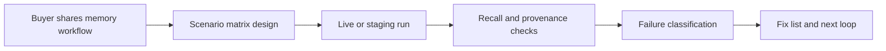

# AI Agent Memory QA Audit

Practical reliability testing for AI agent memory, RAG personalization, and long-running workflow context.

Most AI systems can retrieve something. Fewer can prove that the right memory is stored, updated, deduplicated, scoped, and recalled when the agent needs it later.

I run focused memory evaluations for teams building agents with persistent context, including fact memory, episodic history, procedural lessons, skills, agent roles, workflows, self-update behavior, and failure recovery.

## Offer

### Starter Audit

Price: USD 99

Delivery: 3 business days

Includes:

- 8-12 realistic memory/context scenarios
- pass/fail findings
- prioritized fix list
- recommended next evaluation loop

### Deep Agent Memory Evaluation

Price: USD 499

Delivery: 7 business days

Includes:

- custom live matrix for fact, episodic, and procedural memory
- skill, agent, and workflow memory checks when relevant
- stale-context, dedupe, and bad-write recovery tests
- scope isolation checks across users, workspaces, projects, or tokens
- written report and implementation recommendations

## What Gets Tested

- Fact memory: stable user, company, or project facts with provenance.
- Episodic memory: time-bound events, run history, and handoffs.
- Procedural memory: lessons, policies, and workflows.
- Structured assets: skills, agents, workflows, and approval rules.
- Dedupe: repeated facts should not create noisy recall.
- Stale correction: updated information should replace old context safely.
- Fault tolerance: malformed writes should not poison later recall.
- Scope isolation: private/team/project memory should not bleed across boundaries.
- Self-update: an agent should be able to learn from success and failure with review gates.

## Open Evaluation Matrix

I publish a preview of the evaluation shape so buyers can see the level of depth before starting:

- [Scenario matrix](./SCENARIO_MATRIX.md)
- [Machine-readable JSON](./matrix/agent-memory-eval-matrix.v1.json)
- [Scorecard CSV](./matrix/scorecard.csv)

## Evaluation Flow

## Good Fit

- AI agent founders
- RAG product teams
- LangChain, LangGraph, LlamaIndex, n8n, or custom agent builders
- Automation consultants shipping persistent-memory workflows
- SaaS teams adding personalization or long-term context

## Proof Point

This audit method was used against a real deployed memory service. The live matrix exposed issues in duplicate extraction behavior and stale typed metadata after candidate edits. After fixes, the production service passed 26 of 26 checks.

## Start

Open an intake issue using the template in this repository, or email:

eldwin.easynet.world@gmail.com

Please include:

- your agent or RAG stack
- what the system should remember
- what it must never remember
- the memory failure you most want to avoid
- whether you have a staging environment, traces, docs, or sample prompts
